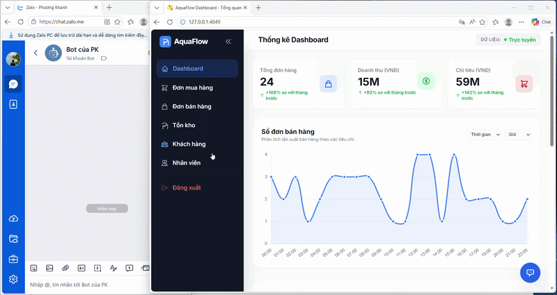
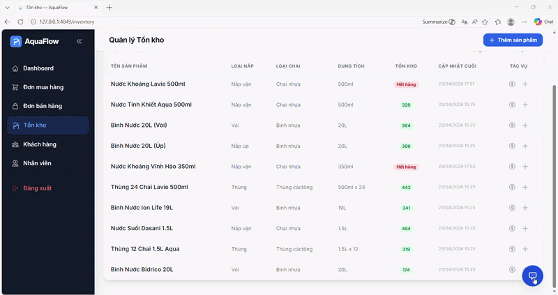

# 🌊 AQUASUPPLY AI

An intelligent system for automating water supply business operations using AI, including chatbot ordering and SQL-based data querying.

---

## 🚀 Features

### 🤖 Order Through ZaloBot

Customers can place orders directly via Zalo chatbot using natural language.

<p align="center">
     <br/>
    <em>Example of ordering via Zalo chatbot</em>
</p>

---

### 🧠 Ask Data from SQL Database

Query business data (sales, inventory, products, etc.) using natural language powered by LLM → Text-to-SQL.

<p align="center">
     <br/>
    <em>Example of querying SQL database using AI</em>
</p>

---

## 🧩 System Architecture

```text
<----   Order Flow  ---->

User (Zalo) 
   ↓
Webhook (FastAPI)
   ↓
LLM (Intent Detect / Text-to-SQL / SQL-to-Text)
   ↓
Database (SQL Lite)
   ↓
Response → Zalo

<----   Ask Data Flow  ---->


...


